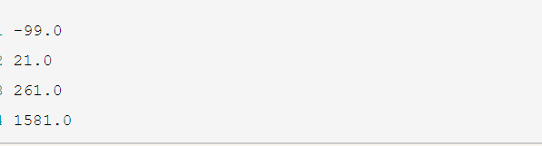

# 试题1

### 题目1

有四个数字：1、2、3、4，能组成多少个互不相同且无重复数字的三位数？各是多少？

实例：

### 题目2

企业发放的奖金根据利润提成。

利润(I)低于或等于10万元时，奖金可提10%；利润高于10万元，低于20万元时，低于10万元的部分按10%提成，高于10万元的部分，可提成7.5%；20万到40万之间时，高于20万元的部分，可提成5%；40万到60万之间时高于40万元的部分，可提成3%；60万到100万之间时，高于60万元的部分，可提成1.5%，高于100万元时，超过100万元的部分按1%提成，从键盘输入当月利润I，求应发放奖金总数？

### 题目3

一个整数，它加上100后是一个完全平方数，再加上168又是一个完全平方数，请问该数是多少？

### 题目4

输入三个整数x,y,z，请把这三个数由小到大输出。
:smile:

### 题目5

输出斐波那契数列

